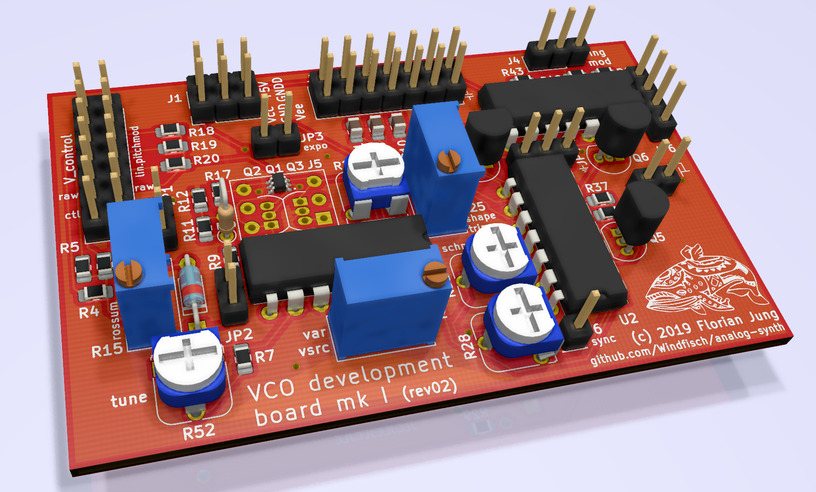
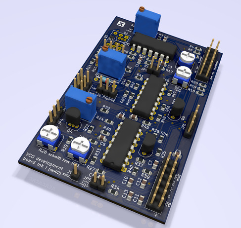
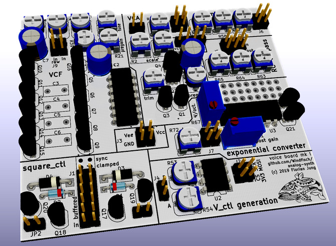

# Analog Synthesizer Project

This project attempts to build a **low-cost** analog synthesizer based on
well-available components like LM324 or TL084 op-amps, which is **easy
to understand and learn**.

The goal is a semimodular synthesizer which is compatible to existing other
systems, where possible. The following features are planned:

- two 1-Volt-per-octave voltage controlled oscillators (VCO) with triangle,
  PWM-able square, and sawtooth waveforms
- the option to use them as digital controlled oscillators (DCO)
- a voltage controlled filter (VCF)
- a voltage controlled amplifier (VCA)
- digital or analog envelope generators
- analog waveshaping and distortion circuits
- USB or MIDI interface based on a STM32 microcontroller

For the sake of simplicity, the following trade-offs are being made:

- exact component selection is traded for automatic or semiautomatic tuning
  where possible:
- no exact 1-volt-per-octave frequency behaviour: The VCO's frequency response
  is not 100% perfect. While commercial synthesizers offer complex analog
  compensation circuitry, this project will measure the frequency deviation
  and compensate for it in software at the stage of the
  MIDI-to-Control-Voltage interface.
- no voltage controlled analog envelopes: These are complicated to build, and
  the difference to digital envelopes or LFOs is not noticeable.

## Required Hardware

So far, apart from standard resistors and capacitors, the synth uses LM324 op
amps, and BC547 / 2N3904 bipolar-junction-transistors and 2N7000 MOSFETs.

The control logic and its firmware is currently based upon a STM32F103 based
*"blue pill"* board, which can be sourced for less than 2 EUR from your
favourite chinese seller. ([Note](bluepill.md): look for those boards with a rectangular white reset
switch, not a flat round one.)
Previous versions were developed for the
[STM32F411 discovery board](https://www.st.com/en/evaluation-tools/32f411ediscovery.html),
which should still work after adjusting the Makefile.

## Repo Contents

under `simulation/`, some circuitry was tested (using the KiCAD SPICE
simulation).

Most importantly, `simulation/vco` shows a functional exponential VCO. There
are detailed annotations on which part serves which purpose.

Under `measure_vco/` you can find the tooling and test results for measuring
the pitch deviation of the VCO.

[hardware/](hardware/) contains the actual hardware boards and drafts:

  - The [VCO development board mk I](hardware/vco_mk1).
    
    
  - A [voice supplement board](hardware/voice_board) containing a VCA, VCF and
    some utility functions.
    
  - A [main control board](hardware/control_board_prototype) with a STM32 blue
    pill board, utility DACs and the supply voltage generation.
    

## Setup

To build libopencm3:

```
git submodule update --init
make -j8 -C libopencm3
```

If you're using a STM32F411 board, you must adjust `measure_vco/firmware/Makefile`
and use the `DEVICE=stm32f411re` instead of the `DEVICE=stm32f103c8t` line.

To measure the vco frequency response:

```
cd measure_vco/firmware
make
```

then do whatever is neccessary to flash the program onto your board. For the blue
pill board, putting it into bootloader mode by jumpering BOOT0 to 1, resetting, and
calling `stm32flash -w dac_test.bin /dev/ttyUSB0` does the job, while for my
STM32F411-discovery, which has a non-standard blackmagic firmware on the STLINK chip, it is:

```
arm-none-eabi-gdb dac_test.elf # make sure it loads the .gdbinit file
load
run
```

Connect the pins correctly, then record the output with an UART adapter
(or using the blackmagic uart device).


## Licensing

All software, firmware and schematics are released under the terms of the [GPL3 license](LICENSE.md).
Note that this does not include the `simulation/**/*.lib` files needed for
simulation. Vendor licensing as noted in the respective files applies.

