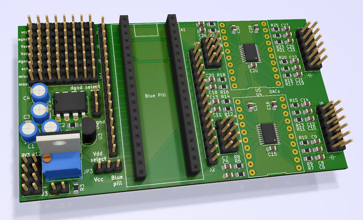

Control Board mk I
==================

The main board of the synth: It accepts a STM32F103 Blue Pill board and offers
two 10-channel DACs. Additionally, it contains a voltage converter, a virtual
ground circuit and pin headers for power distribution.

Setup
-----

Adjust to R2 to 540 Ohms to get a supply voltage of 10V.

U3 is optional. If U3 is equipped, do not close JP1. (C1, C2, R4 and R5 can
be left out in this case.) Otherwise, do close JP1.

JP2 controls whether the digital ground is connected to the analog ground, or
whether DGND is a separate buffered voltage source.

Similarly, JP3 allows to switch between the analog supply voltage and the
blue pill board's 5V supply voltage.

Revisions
---------

- rev01: Has no marking and no wind fish on the back side.
- rev02: Small overlapping silk screen fixes. Has a wind fish and "rev02" on the back side. Was never fabricated.

Tested configuration
--------------------

rev01 has been used successfully with the following configuration:

- U2 was changed to TL072.
- JP1 closed, U3 not equipped.
- JP2 (dgnd select) in *sep* configuration.
- JP3 (Vdd select) in *blue pill* configuration.
- DAC section (i.e. U4,U5, >=R6, >=C5) not populated.

Fabrication
-----------

The gerber outputs used for fabrication of rev01 with [JLCPCB](https://jlcpcb.com) are
located under `fab/`.

The fabrication layers indicating which component values to put where
are [here](../voice_and_control_board_fab.pdf).
