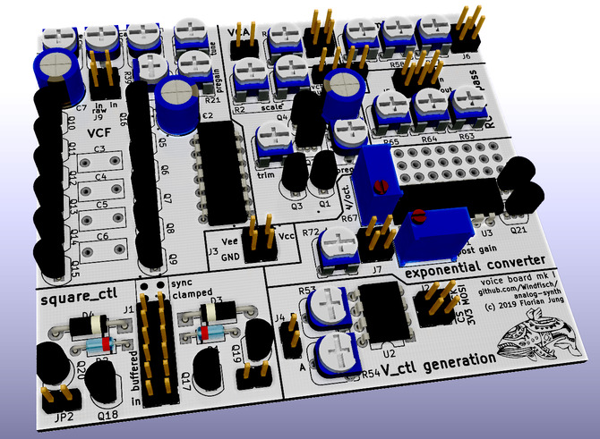

Voice Board mk I
================

This board offers various utility features for a two-VCO-voice. It is designed
to be used together with two [../vco_mk1/](VCO mk I boards) and offers the
following features:

  - voltage controlled filter
  - voltage controlled amplifier
  - simple mixer
  - 2x square_ctl signal processing (buffering, sync pulse generation, clamping,
    which are missing from the VCO mk I board)
  - an expo converter (to be used as VCF input)
  - a 2-channel MCP4822 DAC for VCO control voltage generation
  - three general-purpose RC low pass filters

The gerber outputs used for fabrication with [JLCPCB](https://jlcpcb.com) are
located under `fab/`.

The fabrication layers indicating which component values to put where
are [here](../voice_and_control_board_fab.pdf).

Revisions
---------

**rev01** has no marking at the wind fish logo. It has been fabricated
using the gerber outputs in `fab-rev01/`. Please refer to the errata
below.

**rev02** can be identified by a *"rev02"* text close to the wind fish
logo. It has never been fabricated as it only contains silkscreen and
component value fixes.

Errata (rev01)
--------------

Some resistors in the sync pulse circuitry are wrong. R48 and R49 must
be changed from 10k to 1k. R50 and R51 must be changed from 1k to 10k.
This has been fixed in rev02.
