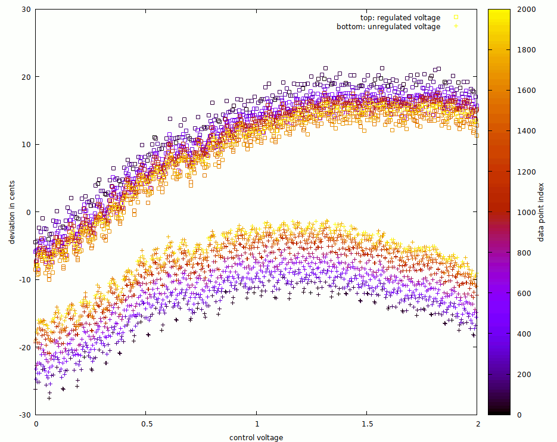

made with d2daf61ccdb65cea5fc738f668ae76e0491451c2.

All following measurements were made using a 9V block battery to power the
circuit.

```
out*.txt:               various measurements with the hand-matched 547 pair.
                        might or might have not touched the transistors during
                        measurement
2019-05-25_bcm847.txt:  measurements using the bcm847 matched transistor chip.
                        shortly but with decent time after placing the
                        transistors on the board
2019-05-25_pair*.txt:   1-3: same, but using hand-matched BC547b transistors
                        instead: these runs were started shortly after placing
                        them in the board. the runs were done subsequently with
                        almost no delay. i sat next to the setup, so they might
                        be affected by my body heat.
2019-05-25_pair.txt4:   same, longer delay, and while aerating the room
```


The following measurements were made using a regulated power supply instead:

```
2019-05-25_pair5_voltagereg.txt:    same as before, but with regulated voltage
```

The following image shows the effect of the voltage regulation on the data:



For the bottom graph without voltage regulation, the spread is much higher.
Furthermore, there is a quite linear-ish color gradient from purple (bottom)
to yellow (top), indicating that earlier data points are at a lower frequency
than late data points.

For the top graph with a regulated supply voltage, the spread / noise is
smaller, and the distribution seems more gaussian than uniform. Most
importantly, the color==time gradient is the opposite direction.

Possible explanation: The circuit's frequency depends on the supply voltage,
because the supply voltage controls the schmitt trigger thresholds. A lower
supply voltage leads to higher frequencies. The bottom graph could exhibit
the effects of a diminishing supply voltage, e.g. because the battery is
drained more and more.

The gradient for the top graph is yet to be explained. Measurement shows that
the control voltage applied to the expo converter's transistor's base is
always negative in this setup, ranging between -30mV and 0mV. During data
acquisition, the room temperature dropped a bit. (Let's say, from 303K to
300K). This changes the thermal voltage of the transistors by 1%, turning the
calibrated 1V-per-oct behaviour into 0.99V-per-oct. This, together with
the effective control voltage being negative, could explain a pitch drop
caused by a temperature drop. (For positive base-voltages, the pitch would
rise instead, and for exactly 0 V base-voltage, the pitch should not change).

